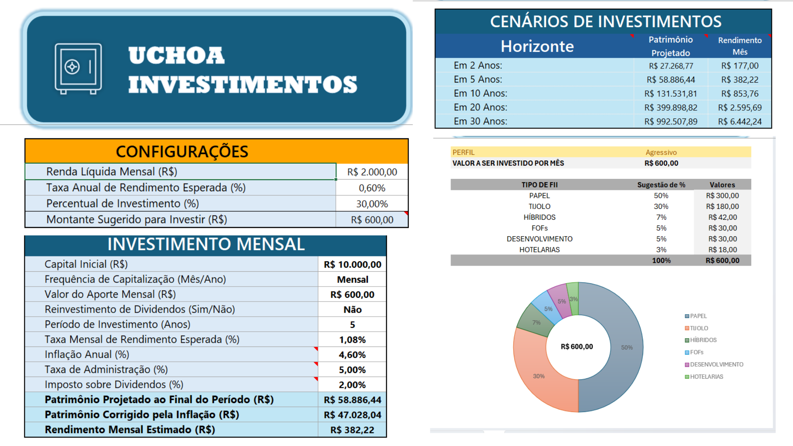

# Planejador de FIIs

  

> Ferramenta em Excel (aba única **APP**) para projetar patrimônio, renda mensal e estruturar seu mix de FIIs conforme perfil de risco.  
> Sem VBA, tudo na aba “APP” e compatível com Excel 365/2021.

---

---

## Sumário

- [Funcionalidades](#funcionalidades)  
- [Requisitos](#requisitos)  
- [Estrutura da Planilha](#estrutura-da-planilha)  
- [Como Usar](#como-usar)  
- [Download](#download)  
- [Acessibilidade](#acessibilidade)  
- [Contribuições](#contribuições)  
- [Licença](#licença)

---

## Funcionalidades

- **Configurações**  
  Defina sua Renda Líquida Mensal, Taxa Anual de Rendimento, Percentual de Investimento e veja o Montante Sugerido.

- **Investimento Mensal**  
  Informe Capital Inicial, Aporte Mensal, Reinvestimento de Dividendos, Período (anos), Taxas e Inflação.  
  Resultado em: Patrimônio Projetado, Patrimônio Corrigido e Rendimento Mensal.

- **Cenários de Investimento**  
  Projeções de Patrimônio e Rendimento em horizontes de 2, 5, 10, 20 e 30 anos.

- **Perfil & Aporte**  
  Selecione seu perfil (Conservador, Moderado, Agressivo) e confira o Valor a Investir/Mês.

- **Alocação em FIIs**  
  Tabela com % sugerido e R$/mês para cada tipo de FII, calculados automaticamente conforme perfil.

- **Gráfico de Rosca**  
  Visualize o mix de alocação (%) e o valor total do aporte no centro do gráfico.

---

## Requisitos

- Microsoft **Excel 365** ou **Excel 2021** (para fórmulas de matriz dinâmica: `ÍNDICE` + `ESCOLHER`).  

---

## Estrutura da Planilha

- **Aba única: “APP”**  
  Todas as entradas, cálculos, tabela de alocação e gráfico estão nesta única aba.

- **Named Ranges**  
  - `inv_Perfil` → célula que contém o perfil de risco.  
  - `inv_Period` → célula do aporte mensal (C42).  
  - `inv_Period_2` → usado **apenas** na caixa de texto central do gráfico de rosca.  
  - Outros nomes (por exemplo, `perfil_TotalValor`) ajudam a deixar as fórmulas mais legíveis.

---

## Como Usar

1. **Configurações**  
   - Preencha: Renda Líquida, Taxa Anual, % de Investimento.  
   - Veja o Montante Sugerido (30 % da renda).

2. **Investimento Mensal**  
   - Insira: Capital Inicial, Frequência (Mensal), Aporte (`inv_Period`), Reinvestimento, Período, Taxas e Inflação.  
   - O Excel calcula automaticamente:  
     - **Patrimônio Projetado** (`VF`)  
     - **Patrimônio Corrigido** (inflação)  
     - **Rendimento Mensal**

3. **Cenários de Investimento**  
   - Analise projeções de patrimônio e renda em 2, 5, 10, 20 e 30 anos.

4. **Perfil & Aporte**  
   - Escolha seu `inv_Perfil` (Conservador/Moderado/Agressivo) em C41.  
   - Confira o valor que será investido por mês (C42 / `inv_Period`).

5. **Alocação em FIIs**  
   - Coluna `%` (C45:C50): fórmula matricial dinâmica (ÍNDICE+ESCOLHER) puxa o benchmark para seu perfil.  
   - Coluna `R$/mês` (D45:D50): `=[D45 *inv_Period_2`  
   - Total (D51) deve somar exatamente seu aporte mensal.

6. **Gráfico de Rosca**  
   -- Geração automática a partir de C45:C50.  
   - Caixa de Texto central vinculada a `=inv_Period_2`, exibindo o total.

---

## Download

Baixe a planilha em:  
[desafio_dio_excel_invest-calc_ver-final_junho-25.xlsx](desafio_dio_excel_invest-calc_ver-final_junho-25.xlsx)

---

## Acessibilidade

- Cores testadas com o [WebAIM Contrast Checker](https://webaim.org/resources/contrastchecker/).  
- Textos alternativos (Alt Text) inseridos em gráficos e imagens para leitores de tela.

---

## Contribuições

Pull requests e issues são muito bem-vindos! Para mudanças de grande impacto, abra uma issue antes de submeter PR.

---

## Licença

Este projeto está licenciado sob a **MIT License**. Veja [LICENSE](./LICENSE) para detalhes.  
